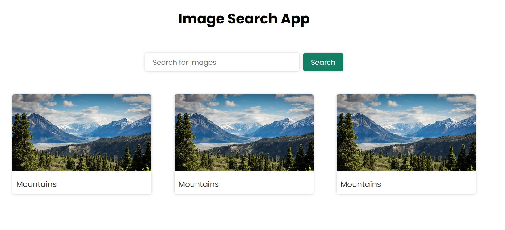
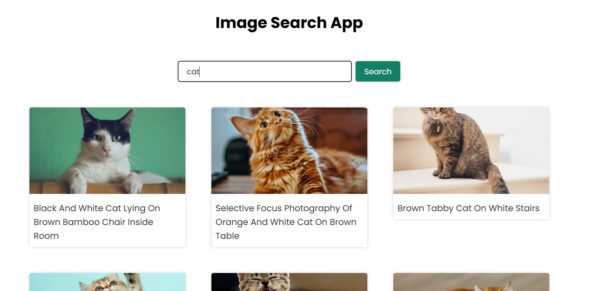

# 🖼️ Image Search App

## 📌 JavaScript Project

An image search application built with **vanilla JavaScript** using the Unsplash API. The application allows users to search for images by keyword and load more results dynamically.
This project was built by following a YouTube tutorial.  

---

## 🚀 Run the Project

1. Clone the repository
2. Open the project folder
3. Add your API key in `script.js`
4. Open `index.html` in your browser

```js
const accessKey = "YOUR_API_KEY_HERE";

## ✨ Features

- Search images by keyword
- Fetch data from Unsplash API
- Dynamic rendering of results
- "Show more" button for pagination
- Responsive layout
- Open image links in a new tab

---

## 📸 Preview


